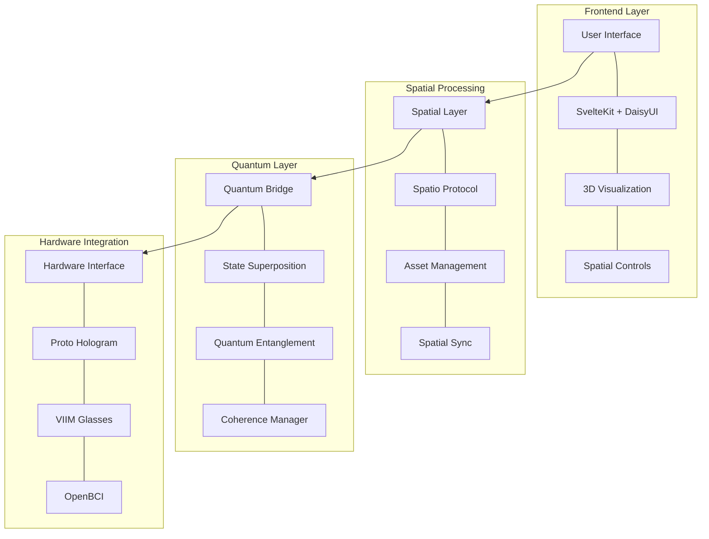

# Proto-Freedom Dashboard 🌌

> A quantum-ready spatial computing dashboard for the Proto ecosystem

[](https://github.com/spatioprotocol)
[](https://daisyui.com)
[]()

## 🌟 Architecture Overview



## 🚀 Quick Start

```bash
# Create project using Bun
bun create proto-freedom

# Install dependencies
bun install

# Add quantum-spatial packages
bun add @spatioprotocol/core @quantum-bridge/core
```

## 📁 Project Structure

```
proto-freedom/
├── src/
│   ├── lib/
│   │   ├── components/
│   │   │   ├── spatial/
│   │   │   ├── quantum/
│   │   │   └── ui/
│   │   ├── stores/
│   │   └── utils/
│   ├── routes/
│   └── app.html
├── static/
├── tests/
└── package.json
```

## 🌈 Core Features

### Spatial Integration

```typescript
// src/lib/spatial/manager.ts
import { SpatioNode, SpatialAddress } from '@spatioprotocol/core';

export class SpatialManager {
  private node: SpatioNode;
  
  constructor() {
    this.node = new SpatioNode({
      quantumReady: true,
      superposition: enabled
    });
  }
  
  async initializeSpatialField() {
    await this.node.createField({
      dimension: '4D',
      quantumStates: true
    });
  }
}
```

### Quantum Bridge

```typescript
// src/lib/quantum/bridge.ts
import { QuantumBridge } from '@quantum-bridge/core';

export class QuantumStateManager {
  private bridge: QuantumBridge;
  
  constructor() {
    this.bridge = new QuantumBridge({
      entanglementSupport: true,
      coherenceTimeout: 1000
    });
  }
  
  async maintainCoherence() {
    await this.bridge.synchronize({
      spatialStates: true,
      quantumField: active
    });
  }
}
```

### UI Components (DaisyUI Enhanced)

```svelte
<!-- src/lib/components/ui/SpatialControls.svelte -->
<script lang="ts">
  import { SpatialManager } from '$lib/spatial/manager';
  import { QuantumStateManager } from '$lib/quantum/bridge';
  
  const spatial = new SpatialManager();
  const quantum = new QuantumStateManager();
</script>

<div class="card w-96 bg-base-100 shadow-xl">
  <div class="card-body">
    <h2 class="card-title">Spatial Control Center</h2>
    <div class="quantum-field-visualizer">
      <!-- 4D Field Visualization -->
    </div>
    <div class="flex justify-between">
      <button class="btn btn-primary" on:click={spatial.initializeSpatialField}>
        Initialize Field
      </button>
      <button class="btn btn-secondary" on:click={quantum.maintainCoherence}>
        Sync States
      </button>
    </div>
  </div>
</div>
```

## 🔮 Hardware Integration

### Proto Hologram Connection

```typescript
// src/lib/hardware/proto.ts
export class ProtoInterface {
  async connect() {
    // Proto connection logic
  }
  
  async synchronizeField(spatialData: SpatialData) {
    // Field synchronization
  }
}
```

### VIIM Glasses Integration

```typescript
// src/lib/hardware/viim.ts
export class VIIMInterface {
  async initializeAR(spatialField: SpatialField) {
    // AR initialization
  }
}
```

### OpenBCI Integration

```typescript
// src/lib/hardware/bci.ts
export class BCIInterface {
  async captureSignals() {
    // Neural signal processing
  }
}
```

## 🎨 Styling

```typescript
// tailwind.config.js
module.exports = {
  content: ['./src/**/*.{html,js,svelte,ts}'],
  theme: {
    extend: {
      colors: {
        quantum: {
          light: '#8B5CF6',
          dark: '#4C1D95'
        },
        spatial: {
          primary: '#2563EB',
          secondary: '#1E40AF'
        }
      }
    }
  },
  plugins: [require('daisyui')],
  daisyui: {
    themes: [
      {
        quantum: {
          primary: '#8B5CF6',
          secondary: '#4C1D95',
          accent: '#37CDBE',
          neutral: '#3D4451',
          'base-100': '#FFFFFF',
        },
      },
    ],
  },
}
```

## 🔄 State Management

```typescript
// src/lib/stores/quantum-state.ts
import { writable } from 'svelte/store';

export const quantumState = writable({
  spatialField: null,
  coherenceLevel: 0,
  entangledStates: [],
  superposition: false
});
```

## 🚀 Deployment

```bash
# Build quantum-ready application
bun run build

# Deploy to quantum-enabled infrastructure
bun run deploy
```

## 🤝 Contributing

See [CONTRIBUTING.md](CONTRIBUTING.md) for guidelines on:
- Quantum state management
- Spatial protocol integration
- Hardware compatibility
- UI/UX improvements

## 📝 License

MIT License - See [LICENSE](LICENSE) for details.
